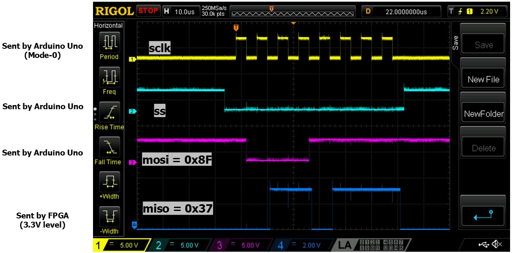

# SPI Controller in VHDL

## Description

This is a repository that contains complete working SPI Controllers 
described in VHDL. The first one is an SPI Master and the second is
an SPI Slave. 

Each of these two SPI controllers have been tested. Each of the two tests
involve two main components: (1) an FPGA board; I used DE1-SoC board
and (2) a microcontroller board; I used an Arduino Uno. Here, you
all files needed to replicate the two tests that verify the correct
operation of teh two SPI controllers.
Complete Quartus II projects are provided in subfolders called "fpga".
Complete Arduino sketches are located in subfolders called "arduino",
for each test circuit.
You will also find folders called "docs" that include concise descriptions
of teh two tests and diagrams that show the connections you need to make 
between the FPGA board and the Arduino Uno board.

## Video description

A short video description can be found on my youtube channel.

<<<<<<< HEAD
If you wanted to replicate this project, these are the main components.

--Arduino Uno board; you can get any, but this is one example:
https://www.amazon.com/ELEGOO-Board-ATmega328P-ATMEGA16U2-Compliant/dp/B01EWOE0UU

--LoL Shield
https://www.olimex.com/Products/Duino/Shields/SHIELD-LOL-SMT/open-source-hardware
But, you can use one of those that you need to solder yourself; just search for
LoL Shield on Ebay and you will find many offerings.

--MPU6050 IMU
https://www.amazon.com/HiLetgo-MPU-6050-Accelerometer-Gyroscope-Converter/dp/B01DK83ZYQ?th=1

--Prototype PCB for Arduino Uno
https://www.amazon.com/dp/B01J1KM3RM?ref=ppx_yo2ov_dt_b_fed_asin_title (used one only of the pack)

--Battery holder
https://www.amazon.com/gp/product/B07C6XC3MP/ref=ppx_yo_dt_b_search_asin_title?ie=UTF8&psc=1

## Software

--Arduiono IDE

--Libraries needed:
1) LoLShield v82.zip - Downloaded from here: 
https://code.google.com/archive/p/lolshield/downloads
Installed from .ZIP inside the Arduino IDE.
2) Adafruit MPU6050
Installed through the Library Manager of the Arduino IDE.

## Credits

The source code is adapted from that of Chuck Swiger.
His code is here: https://github.com/cswiger/LED_sand

Inspired also by a project from Adafruit:
https://learn.adafruit.com/animated-led-sand?embeds=allow
=======
https://www.youtube.com/@eigenpi

## Credits

The SPI Controller Master is adapted from the wonderful book of Pong P. Chu
(I highly reccommend reading the book for further details):
[1] Pong P. Chu, FPGA Prototyping by VHDL Examples: Xilinx MicroBlaze 
    MCS SoC, Wiley, 2nd edition, October 23, 2017.
>>>>>>> 0078a6e (First commit)
